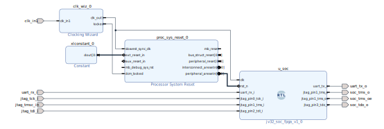

# jv32 SoC — FPGA Implementation (Kintex UltraScale+ KU5P)

**Tool:** Vivado ML Standard (free licence)
**Part:** `xcku5p-ffvb676-2-i` (Kintex UltraScale+, -2I speed grade, 676-pin FFVB)
**Default debug interface:** cJTAG / 2-wire OScan1 (`USE_CJTAG=1`)

---

## Directory layout

```
fpga/
├── Makefile                        # build orchestration
├── README.md
├── images/
│   └── jv32_bd.svg                 # IP Integrator block design diagram
├── jtag/
│   ├── jv32_fpga_cjtag.cfg         # OpenOCD config – USE_CJTAG=1 (2-wire)
│   └── jv32_fpga_jtag.cfg          # OpenOCD config – USE_CJTAG=0 (4-wire)
├── rtl/
│   ├── jv32_fpga_top.sv            # FPGA top-level wrapper (IOBUF, USE_CJTAG mux)
│   └── jv32_soc_fpga.v             # Plain-Verilog BD module reference wrapper
├── constrs/
│   ├── constraints.xdc             # Shared pin / clock constraints (both modes)
│   ├── constraints_cjtag.xdc       # Implementation-only: USE_CJTAG=1 clock + I/O
│   └── constraints_jtag.xdc        # Implementation-only: USE_CJTAG=0 I/O delays
├── scripts/
│   ├── create_project.tcl          # Vivado project / synth / impl script
│   └── create_bd.tcl               # IP Integrator block design script
├── tests/
│   ├── Makefile
│   └── fpga_stress.c               # Long-running FreeRTOS stability stress test
└── build/                          # Vivado project output (git-ignored)
    ├── jv32_ku5p_cjtag.bit         # USE_CJTAG=1 bitstream (default)
    ├── jv32_ku5p_cjtag.mcs         # USE_CJTAG=1 SPI flash image
    ├── jv32_ku5p_cjtag.prm         # USE_CJTAG=1 flash programming params
    ├── jv32_ku5p_jtag.bit          # USE_CJTAG=0 bitstream
    ├── jv32_ku5p_jtag.mcs          # USE_CJTAG=0 SPI flash image
    └── jv32_ku5p_jtag.prm          # USE_CJTAG=0 flash programming params
```

---

## Prerequisites

| Requirement | Notes |
|---|---|
| Vivado ML Standard 2023.x or later | Free licence — no cost for KU5P devices |
| RISC-V GNU toolchain (`riscv64-unknown-elf-`) | For building `fpga/tests/` firmware |
| FT2232H-based JTAG/cJTAG probe | e.g. Digilent HS2, FTDI FT2232H mini-module |
| OpenOCD ≥ 0.12 with `oscan1_mode` support | Required for USE_CJTAG=1 |

Add `RISCV_PREFIX` to `env.config` if your toolchain prefix differs from the default.

---

## Quick start

```bash
cd fpga/

# Create Vivado project (cJTAG default, no synthesis yet)
make project

# Run synthesis only
make synth

# Full implementation + bitstream generation
make impl

# 4-wire JTAG variant
make impl USE_CJTAG=0
```

Bitstream and MCS files land in `build/`.

---

## Block Design



The IP Integrator block design `jv32_bd` contains three cells:

| Cell | IP / Type | Role |
|---|---|---|
| `clk_wiz_0` | Clocking Wizard (MMCM) | 50 MHz board clock → 50 MHz clean `clk_out1`; exports `locked` |
| `proc_sys_reset_0` | Processor System Reset | Holds `rst_n` (active-low) low until MMCM `locked` asserts |
| `u_soc` | `jv32_soc_fpga` (RTL module ref) | jv32 SoC — plain-Verilog wrapper around `jv32_soc.sv` |

The `IOBUF` primitive (bidirectional TMSC pad) and the `USE_CJTAG` I/O mux are
**not** inside the block design — they live in `jv32_fpga_top.sv` because
Vivado's IP Integrator does not support inout ports on RTL module references.

The generated wrapper `jv32_bd_wrapper` is instantiated in `jv32_fpga_top.sv`,
which remains the synthesis and implementation top module.

### Block design external ports

| Port | Dir | Connected to (jv32_fpga_top.sv) |
|---|---|---|
| `clk_in1` | I | `clk_50m` (FPGA pin E18) |
| `jtag_tck_i` | I | `jtag_tck_i` port |
| `jtag_tmsc_in` | I | `tmsc_in` — IOBUF output (pad → fabric) |
| `jtag_tdi_i` | I | `jtag_tdi_i` port (muxed to `0` inside `jv32_soc_fpga` when `USE_CJTAG=1`) |
| `soc_tms_o` | O | `tmsc_out` — IOBUF input (fabric → pad, cJTAG only) |
| `soc_tms_oe` | O | `tmsc_oe_n` — IOBUF tristate (`T`), active-low |
| `soc_tdo_o` | O | `jtag_tdo_o` port (4-wire JTAG only) |
| `uart_rx_i` | I | `uart_rx_i` port |
| `uart_tx_o` | O | `uart_tx_o` port |

---

## I/O Pin Assignment

All user I/O is on the **HR (High Range) bank**, 3.3 V LVCMOS33, except the
system clock which is on an **HP (High Performance) bank**, 1.8 V LVCMOS18.

| Signal | Pin | Bank / Std | Direction | Function |
|---|---|---|---|---|
| `clk_50m` | E18 | HP / LVCMOS18 | I | 50 MHz system clock |
| `jtag_tck_i` | D11 | HR / LVCMOS33 | I | TCK (4-wire) / TCKC (cJTAG) |
| `jtag_tmsc_io` | E12 | HR / LVCMOS33 | I/O | TMS (4-wire) / TMSC (cJTAG, bidir) |
| `jtag_tdi_i` | C12 | HR / LVCMOS33 | I | TDI — 4-wire JTAG only; unused (tied to GND) in cJTAG |
| `jtag_tdo_o` | J12 | HR / LVCMOS33 | O | TDO — 4-wire JTAG only; driven `0` in cJTAG |
| `uart_tx_o` | G12 | HR / LVCMOS33 | O | UART TX |
| `uart_rx_i` | J14 | HR / LVCMOS33 | I | UART RX |
| `heartbeat_o` | H9 | HR / LVCMOS33 | O | LED6 — toggles every 2²⁴ retired instructions |
| `led_o` | J11 | HR / LVCMOS33 | O | LED3 — 1 Hz blink (1 s on / 1 s off, from clk/rst_n) |

---

## USE_CJTAG Configuration

`USE_CJTAG` selects the debug interface. The default is **`USE_CJTAG=1`** (2-wire cJTAG).

| `USE_CJTAG` | Interface | Wires used | `jtag_tmsc_io` (C12) | `jtag_tdi_i` (J12) | `jtag_tdo_o` (E12) |
|:---:|---|:---:|---|---|---|
| **1 (default)** | 2-wire cJTAG (IEEE 1149.7 OScan1) | TCKC + TMSC | **bidir** — IOBUF driven by SoC | tied to GND on PCB | driven `0` by FPGA |
| 0 | 4-wire JTAG (IEEE 1149.1) | TCK + TMS + TDI + TDO | input only — IOBUF permanently tristated | TDI data in | TDO data out |

The parameter is set at synthesis time:

```bash
make impl USE_CJTAG=1   # default: cJTAG (2-wire)
make impl USE_CJTAG=0   # 4-wire JTAG
```

Vivado passes it as a generics override on the fileset:
```tcl
set_property generic "USE_CJTAG=1'b${use_cjtag}" [current_fileset]
```

### IOBUF behaviour per mode

```
              USE_CJTAG=1 (cJTAG)          USE_CJTAG=0 (JTAG)
              ─────────────────────────    ────────────────────
IOBUF.T    =  soc_tms_oe (1=input, 0=drive)   1'b1  (always input)
IOBUF.I    =  soc_tms_o  (TMSC drive data)    1'b0  (unused)
IOBUF.O    =  tmsc_in  ──► SoC TMS/TMSC input (both modes)
jtag_tdo_o =  1'b0        (TDO unused)        soc_tdo_o
```

---

## Clock Architecture

### Shared constraints (`constraints.xdc`)

The 50 MHz system clock on E18 and the `create_clock` for it are owned by the
`clk_wiz_0` IP XDC (redefining it here would cause XDCC-1/XDCC-7 methodology
warnings).  The shared XDC only sets the pin and I/O standard, adds input
jitter, and declares the UART false paths:

```xdc
set_property PACKAGE_PIN E18 [get_ports clk_50m]
set_property IOSTANDARD LVCMOS18 [get_ports clk_50m]
set_input_jitter clk_50m 0.200

create_clock -period 100.000 -name jtag_tck [get_ports jtag_tck_i]
set_clock_groups -asynchronous \
    -group [get_clocks -include_generated_clocks clk_50m] \
    -group [get_clocks jtag_tck]
```

### USE_CJTAG=1 — `constraints_cjtag.xdc` (implementation only)

In cJTAG mode the TAP clock (`tap_tck`) is generated **inside the SoC** by
`cjtag_bridge` as a registered pulse, buffered through a `BUFG`
(`u_bufg_tck`).  The primary clock must be created on the **BUFG output pin**
to avoid TIMING-1 ("inappropriate pin for clock") and follow Xilinx UG949
recommendations for internally-generated clocks.

```xdc
create_clock -period 100.000 -name tap_tck -waveform {0.000 50.000} \
    [get_pins {u_bd/jv32_bd_i/u_soc/inst/u_soc/gen_jtag.u_jtag/
               gen_pin_mux_cjtag.u_cjtag_bridge/u_bufg_tck/O}]

set_clock_groups -asynchronous \
    -group [get_clocks tap_tck] \
    -group [get_clocks -include_generated_clocks clk_50m]

# tap_tck is downstream of clk_out1 (BUFG driven by an MMCM-clocked FF)
# → declare physically_exclusive to suppress TIMING-3 (AR#63774).
set_clock_groups -physically_exclusive \
    -group [get_clocks -include_generated_clocks clk_50m] \
    -group [get_clocks tap_tck]

set_false_path -from [get_ports jtag_tmsc_io]
set_false_path -to   [get_ports jtag_tmsc_io]
set_false_path -from [get_ports jtag_tdi_i]
set_false_path -to   [get_ports jtag_tdo_o]
```

Maximum TCKC frequency: **50 MHz ÷ 6 ≈ 8.3 MHz** (cjtag_bridge requirement:
`f_sys ≥ 6 × f_tckc`).  The OpenOCD config uses **5 MHz** for margin.

### USE_CJTAG=0 — `constraints_jtag.xdc` (implementation only)

In 4-wire JTAG mode the external `jtag_tck_i` pin is the primary clock source
(declared in `constraints.xdc`).  TDI is captured on the rising edge of TCK;
TDO is launched on the **falling** edge.

```xdc
set_false_path -from [get_ports jtag_tmsc_io]
set_false_path -to   [get_ports jtag_tmsc_io]

set_input_delay  -clock jtag_tck -max 10.0            [get_ports jtag_tdi_i]
set_input_delay  -clock jtag_tck -min  0.0 -add_delay [get_ports jtag_tdi_i]

set_output_delay -clock jtag_tck -clock_fall -max 10.0            [get_ports jtag_tdo_o]
set_output_delay -clock jtag_tck -clock_fall -min  0.0 -add_delay [get_ports jtag_tdo_o]
```

Maximum TCK frequency: **10 MHz** (100 ns period, `constraints.xdc`).
The OpenOCD config uses **10 MHz**; reduce to 1 MHz if signal integrity is poor.

### Clock domain summary

| Clock | Source | Frequency | Domain |
|---|---|---|---|
| `clk_out1_*` (system) | MMCM (`clk_wiz_0`) from E18 | 50 MHz | `jv32_soc`, AXI peripherals, UART, CLIC |
| `tap_tck` | Internal BUFG in `cjtag_bridge` | ≤ 8.3 MHz | TAP, DTM (`USE_CJTAG=1`) |
| `jtag_tck` | External pin D11 | ≤ 10 MHz | TAP, DTM (`USE_CJTAG=0`) |

The two clock domains are fully asynchronous; CDC is handled by the
multi-stage synchroniser chains in `jv32_dtm`.

---

## Vivado project variables

| Variable | Default | Description |
|---|---|---|
| `VIVADO` | `vivado` | Path to Vivado executable |
| `PROJ_NAME` | `jv32_ku5p` | Vivado project name |
| `PROJ_DIR` | `fpga/build` | Project output directory (repo-relative) |
| `TOP_MODULE` | `jv32_fpga_top` | Synthesis/implementation top module |
| `FPGA_PART` | `xcku5p-ffvb676-2-i` | Xilinx device part number |
| `JV32_CLK_HZ` | `50000000` | System clock frequency (Hz) — passed to SoC |
| `FLASH_PART` | `mt25qu256-spi-x1_x2_x4` | SPI flash part for MCS generation |
| `USE_CJTAG` | **`1`** | `1` = 2-wire cJTAG (default); `0` = 4-wire JTAG |

RTL `define` macros enabled in Vivado:

| Macro | Effect |
|---|—|
| `XILINX_URAM` | Selects UltraRAM inference path in `sram_1rw.sv` (XCKU5P has URAMs) |

---

## Connecting a debug probe

### USE_CJTAG=1 (default) — 2-wire cJTAG

Requires a bitstream built with `USE_CJTAG=1` (the default).

**Wiring (FT2232H Channel A → XCKU5P)**

| FT2232H pin | Signal | FPGA pin | Note |
|---|---|---|---|
| ADBUS0 | TCKC | D11 | cJTAG clock, unidirectional |
| ADBUS3 | TMSC | C12 | cJTAG data, **bidirectional** |
| GND | GND | GND | |
| ADBUS1, ADBUS2 | — | — | Unused in cJTAG mode |

```bash
openocd -f fpga/jtag/jv32_fpga_cjtag.cfg
openocd -f fpga/jtag/jv32_fpga_cjtag.cfg -c "init; halt"
```

### USE_CJTAG=0 — 4-wire JTAG

Requires a bitstream built with `USE_CJTAG=0`.

**Wiring (FT2232H Channel A → XCKU5P)**

| FT2232H pin | Signal | FPGA pin | Note |
|---|---|---|---|
| ADBUS0 | TCK | D11 | |
| ADBUS1 | TDI | J12 | |
| ADBUS2 | TDO | E12 | |
| ADBUS3 | TMS | C12 | |
| GND | GND | GND | |

```bash
openocd -f fpga/jtag/jv32_fpga_jtag.cfg
openocd -f fpga/jtag/jv32_fpga_jtag.cfg -c "init; halt"
```

---

## Loading firmware via OpenOCD

```bash
# Load and run ELF from GDB / OpenOCD
openocd -f fpga/jtag/jv32_fpga_cjtag.cfg \
        -c "program build/fpga-stress.elf verify reset exit"
```

UART output is on `uart_tx_o` (J14), **921600 8N1**:

```bash
# Linux
stty -F /dev/ttyUSBx 921600 raw && cat /dev/ttyUSBx
# Windows / macOS: PuTTY / CoolTerm at 921600 8N1
```

---

## FPGA stress test

`fpga/tests/fpga_stress.c` is a long-running FreeRTOS stability test designed
to run for days/weeks on the FPGA, exercising CPU execution, memory, UART,
queues, semaphores, event groups, and a recursive mutex.

```bash
make -C fpga/tests          # build fpga-stress.elf
openocd -f fpga/jtag/jv32_fpga_cjtag.cfg \
        -c "program fpga/tests/build/fpga-stress.elf verify reset exit"
```

One status line is printed over UART every 5 seconds:
```
[HHH:MM:SS] A=<cpu_iters> B=<q_sent> C=<ev_rounds> D=<sem_rounds>
            E=<mtx_iters> F=<mem_allocs> err=<total> heap=<free> wdf=<wdog_faults>
```
