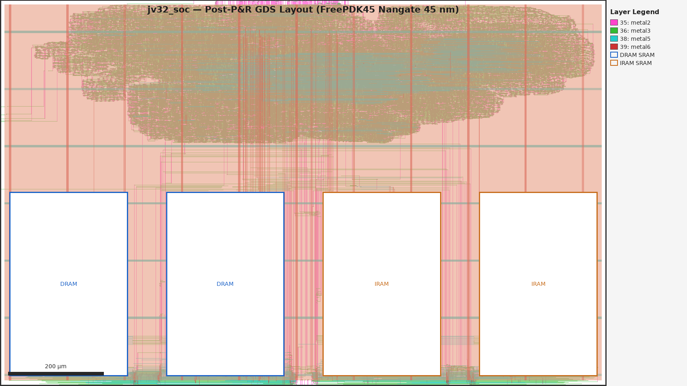

# jv32 SoC — Synthesis & P&R with OpenRAM + OpenLane2 (Nangate 45nm)

## Overview

This directory implements the full physical implementation flow for `jv32_soc`:

1. **OpenRAM** compiles the TCM SRAM macros with the Nangate 45nm (FreePDK45) process.
2. **OpenLane2** runs the Classic flow: synthesis → floorplan → placement → CTS → routing → signoff.

## Directory layout

```
syn/
├── Makefile                          # build orchestration
├── README.md
├── common/
│   └── rtl_filelist.f                # ordered RTL file list for synthesis
├── lib/
│   ├── sram_1rw.sv                   # synthesis black-box wrapper (maps to OpenRAM macros)
│   └── openram/                      # generated by 'make gen-mem' (git-ignored)
│       ├── sram_1rw_1024x64.lef
│       ├── sram_1rw_1024x64.gds
│       ├── sram_1rw_1024x64.v
│       ├── sram_1rw_1024x64_TT_1p1V_25C.lib
│       ├── sram_1rw_1024x64_FF_1p0V_25C.lib
│       └── sram_1rw_1024x64_SS_1p0V_25C.lib
├── openlane/
│   ├── config.yaml                   # OpenLane2 design configuration
│   ├── jv32_soc_pnr.sdc             # PnR timing constraints
│   └── macro_placement.cfg           # fixed SRAM macro placement coordinates
├── scripts/
│   ├── openlane_nix.sh               # OpenLane2 Nix shell launcher
│   └── openroad/
│       ├── report_timing.tcl         # post-route timing report helper
│       └── run_pnr.tcl               # standalone OpenROAD P&R script
└── pdk/
    ├── NangateOpenCellLibrary_typical.lib   # Nangate std-cell timing lib
    └── freepdk45/
        └── libs.tech/
            ├── klayout/
            │   └── freepdk45.map            # KLayout layer map
            ├── magic/
            │   ├── freepdk45.magicrc
            │   └── freepdk45.tcl
            ├── netgen/
            │   └── freepdk45.tcl
            └── openlane/
                ├── config.tcl               # PDK-level OpenLane2 config
                └── NangateOpenCellLibrary/
                    ├── config.tcl           # SCL-level OpenLane2 config
                    ├── tracks.info          # metal track table (legacy format)
                    ├── drc_exclude.cells    # cells excluded from DRC
                    └── no_synth.cells       # cells excluded from synthesis
```

## Prerequisites

### 1. Tools

| Tool | Source | Required for |
|------|--------|-------------|
| OpenRAM 1.2.48 | `$HOME/OpenRAM-1.2.48` | SRAM macro compilation |
| OpenLane 2.x | `$HOME/openlane2` | Synthesis + P&R |
| Python 3.8+ | system | running OpenRAM scripts |

### 2. Nangate 45nm Open Cell Library (FreePDK45)

The full Nangate OpenCellLibrary is required for P&R (LEF + GDS).
The timing lib (`NangateOpenCellLibrary_typical.lib`) is already checked in to `syn/pdk/`.

Download the complete FreePDK45 release from NC State University:
<https://www.eda.ncsu.edu/wiki/FreePDK45>

After download, set `NANGATE_HOME` in `env.config`:

```
NANGATE_HOME=/path/to/FreePDK45/NangateOpenCellLibrary
```

Expected files under `NANGATE_HOME`:
- `NangateOpenCellLibrary.tech.lef`
- `NangateOpenCellLibrary.macro.lef` (or `.macro.mod.lef`)
- `NangateOpenCellLibrary.gds`
- `liberty/NangateOpenCellLibrary_typical.lib` *(optional; local copy is used otherwise)*

### 3. env.config

Add the following to `$PROJECT_ROOT/env.config`:

```makefile
# ── ASIC flow tools ──────────────────────────────────────────────────────────
OPENRAM      = $(HOME)/OpenRAM-1.2.48
OPENLANE     = $(HOME)/openlane2
NANGATE_HOME = /path/to/FreePDK45/NangateOpenCellLibrary
```

## Quick start

```bash
cd syn/

# 1. Create the local Python venv for OpenRAM
make openram-setup

# 2. Compile the SRAM macros (Nangate 45nm, 16 KB IRAM + DRAM — evaluation)
make gen-mem

# 3. Run OpenLane2 (synthesis + place + route + signoff)
make synth
```

Results land in `build/openlane_run/`.

## SRAM macro details

jv32 TCM memories are currently configured for **16 KB** each (evaluation).
Each TCM is decomposed into 2 × `sram_1rw_1024x64` sub-banks:

```
IRAM (16 KB) = 2 × sram_1rw_1024x64   (1024 words × 64-bit,  addr[10] = bank select)
DRAM (16 KB) = 2 × sram_1rw_1024x64   (same macro,  4 instances total)
```

### Macro physical parameters (`words_per_row = 4`)

| Parameter | Value |
|---|---|
| Configuration | 1024 words × 64-bit, 8 write-mask bits |
| `words_per_row` | 4 — 256 rows, 256 bits/row (~1:1.6 W:H aspect ratio) |
| LEF SIZE | **247.88 × 386.12 µm** |
| 4-macro footprint | 1249.02 µm wide × 406.12 µm tall (at y = 20 µm) |

The RTL source (`rtl/jv32_soc.sv`, `rtl/jv32/jv32_top.sv`) retains 128 KB as its
module-parameter default; the synthesis build overrides to 16 KB via
`SYNTH_PARAMETERS` in `openlane/config.yaml` and `IRAM_SIZE`/`DRAM_SIZE` in
`syn/Makefile`.

To switch to a different TCM size, update both those two locations and
add/select the matching generate-branch in `syn/lib/sram_1rw.sv`:

```bash
# Example: 64 KB each
make gen-mem IRAM_SIZE=65536 DRAM_SIZE=65536
```

## OpenLane2 flow details

The `openlane/config.yaml` targets:
- **PDK**: `freepdk45` (Nangate 45nm Open Cell Library)
- **Clock**: 80 MHz (12.5 ns period)
- **Core utilisation**: 40% placement density (`PL_TARGET_DENSITY: 0.4`)
- **Global routing**: up to Metal9

The custom PDK configuration lives in `pdk/freepdk45/libs.tech/openlane/`.
OpenLane2 is invoked with `--pdk-root $(CURDIR)/pdk --pdk freepdk45`.

### Current synthesised configuration

The parameters below are written to `build/tcm_params.yaml` by `make synth` /
`make gen-mem` and are passed to Yosys via `SYNTH_PARAMETERS`:

| Parameter | Value | Description |
|---|---|---|
| `IRAM_SIZE` | `16384` (16 KB) | IRAM size in bytes |
| `DRAM_SIZE` | `16384` (16 KB) | DRAM size in bytes |
| `FAST_MUL` | **`1`** | Combinatorial multiplier (1-cycle) |
| `FAST_DIV` | **`0`** | Serial restoring divider (variable latency) |
| `FAST_SHIFT` | **`1`** | Barrel shifter (1-cycle) |
| `BP_EN` | **`1`** | Branch predictor enabled |

To change any parameter pass it on the `make` command line, e.g.:

```bash
make synth FAST_MUL=1 FAST_SHIFT=1
```

## Variables reference

| Variable | Default | Description |
|----------|---------|-------------|
| `OPENRAM` | `$(HOME)/opt/OpenRAM` | OpenRAM root |
| `OPENLANE` | `$(HOME)/opt/openlane2` | OpenLane2 root |
| `NANGATE_HOME` | *(must be set)* | Nangate 45nm library root |
| `IRAM_SIZE` | `16384` (16 KB) | IRAM size in bytes (evaluation; RTL default 128 KB) |
| `DRAM_SIZE` | `16384` (16 KB) | DRAM size in bytes (evaluation; RTL default 128 KB) |
| `OPENRAM_OPTIMIZE` | `speed` | `speed` or `area` |
| `FAST_MUL` | `1` | `1` = combinatorial multiplier; `0` = serial shift-and-add (variable latency) |
| `FAST_DIV` | `0` | `1` = combinatorial divider; `0` = serial restoring divider (variable latency) |
| `FAST_SHIFT` | `1` | `1` = barrel shifter (1 cycle); `0` = 1-bit-per-cycle serial shifter |
| `BP_EN` | `1` | `1` = enable branch predictor; `0` = always-not-taken |

## Synthesis Results — RV32EC=1

> Source: `build/gate_count.rpt` (hierarchical Yosys synthesis, Nangate 45 nm OCL).
> Reference cell: NAND2\_X1 = 0.7980 µm².  SRAM macros treated as black-boxes (area excluded).
>
> Configuration: `RV32EC=1  RV32E_EN=1  RV32M_EN=0  JTAG_EN=0  AMO_EN=0`
> `FAST_MUL=0  FAST_DIV=0  FAST_SHIFT=0  BP_EN=0`

### Area Hierarchy (Gate Count)

| Module | NAND2-eq | Area (µm²) |
|---|---:|---:|
| **jv32_soc** | **41,397** | **33,034.54** |
| ↳ jv32_top | 30,833 | 24,604.47 |
| &nbsp;&nbsp;↳ jv32_core | 26,781 | 21,370.97 |
| &nbsp;&nbsp;&nbsp;&nbsp;↳ jv32_regfile | 6,027 | 4,809.55 |
| &nbsp;&nbsp;&nbsp;&nbsp;↳ jv32_csr | 5,022 | 4,007.82 |
| &nbsp;&nbsp;&nbsp;&nbsp;↳ jv32_rvc | 2,083 | 1,662.23 |
| &nbsp;&nbsp;&nbsp;&nbsp;↳ jv32_alu | 1,633 | 1,302.87 |
| &nbsp;&nbsp;&nbsp;&nbsp;↳ jv32_decoder | 442 | 352.98 |
| &nbsp;&nbsp;↳ sram_1rw | 253 | 202.16 |
| ↳ axi_clic | 5,369 | 4,284.20 |
| ↳ axi_uart | 3,722 | 2,969.89 |
| ↳ axi_xbar | 568 | 453.00 |

### Clock Gating Summary

> ICG cell: `CLKGATE_X1` / `CLKGATETST_X1` (Nangate 45 nm).
> Gated% = Gated\_FFs / Total\_FFs (FF clock driven by a CLKGATE GCK output).

| Module | Total FFs | Gated FFs | Gated% |
|---|---:|---:|---:|
| **jv32_soc** | **2,819** | **2,431** | **86.2%** |
| ↳ jv32_top | 1,993 | 1,677 | 84.1% |
| &nbsp;&nbsp;↳ jv32_core | 1,642 | 1,405 | 85.6% |
| &nbsp;&nbsp;&nbsp;&nbsp;↳ jv32_regfile | 512 | 512 | 100.0% |
| &nbsp;&nbsp;&nbsp;&nbsp;↳ jv32_csr | 336 | 208 | 61.9% |
| &nbsp;&nbsp;&nbsp;&nbsp;↳ jv32_rvc | 51 | 51 | 100.0% |
| &nbsp;&nbsp;&nbsp;&nbsp;↳ jv32_alu | 79 | 78 | 98.7% |
| &nbsp;&nbsp;&nbsp;&nbsp;↳ jv32_decoder | 0 | 0 | 0.0% |
| &nbsp;&nbsp;↳ sram_1rw | 2 | 0 | 0.0% |
| ↳ axi_clic | 361 | 297 | 82.3% |
| ↳ axi_uart | 386 | 382 | 99.0% |
| ↳ axi_xbar | 69 | 67 | 97.1% |

---

## Synthesis Results — RV32EC=0

> Source: `build/gate_count.rpt` (hierarchical Yosys synthesis, Nangate 45 nm OCL).
> Reference cell: NAND2\_X1 = 0.7980 µm².  SRAM macros treated as black-boxes (area excluded).
>
> Configuration: `RV32EC=0  RV32E_EN=0  RV32M_EN=1  JTAG_EN=1  AMO_EN=1`
> `FAST_MUL=1  FAST_DIV=0  FAST_SHIFT=1  BP_EN=1`

### Area Hierarchy (Gate Count)

| Module | NAND2-eq | Area (µm²) |
|---|---:|---:|
| **jv32_soc** | **85,250** | **68,029.50** |
| ↳ jv32_top | 56,559 | 45,134.08 |
| &nbsp;&nbsp;↳ jv32_core | 52,493 | 41,889.68 |
| &nbsp;&nbsp;&nbsp;&nbsp;↳ jv32_alu | 17,464 | 13,936.01 |
| &nbsp;&nbsp;&nbsp;&nbsp;↳ jv32_regfile | 12,479 | 9,958.51 |
| &nbsp;&nbsp;&nbsp;&nbsp;↳ jv32_csr | 5,073 | 4,048.25 |
| &nbsp;&nbsp;&nbsp;&nbsp;↳ jv32_rvc | 2,069 | 1,650.80 |
| &nbsp;&nbsp;&nbsp;&nbsp;↳ jv32_decoder | 433 | 345.53 |
| &nbsp;&nbsp;↳ sram_1rw | 253 | 202.16 |
| ↳ jtag_top | 16,395 | 13,083.21 |
| &nbsp;&nbsp;↳ jtag_tap | 16,395 | 13,083.21 |
| &nbsp;&nbsp;&nbsp;&nbsp;↳ jv32_dtm | 16,183 | 12,913.77 |
| ↳ axi_clic | 5,403 | 4,311.59 |
| ↳ axi_uart | 3,697 | 2,950.47 |
| ↳ axi_xbar | 568 | 453.00 |

### Clock Gating Summary

> ICG cell: `CLKGATE_X1` / `CLKGATETST_X1` (Nangate 45 nm).
> Gated% = Gated\_FFs / Total\_FFs (FF clock driven by a CLKGATE GCK output).

| Module | Total FFs | Gated FFs | Gated% |
|---|---:|---:|---:|
| **jv32_soc** | **5,788** | **4,712** | **81.4%** |
| ↳ jv32_top | 3,089 | 2,805 | 90.8% |
| &nbsp;&nbsp;↳ jv32_core | 2,738 | 2,533 | 92.5% |
| &nbsp;&nbsp;&nbsp;&nbsp;↳ jv32_alu | 403 | 402 | 99.8% |
| &nbsp;&nbsp;&nbsp;&nbsp;↳ jv32_regfile | 1,024 | 1,024 | 100.0% |
| &nbsp;&nbsp;&nbsp;&nbsp;↳ jv32_csr | 336 | 208 | 61.9% |
| &nbsp;&nbsp;&nbsp;&nbsp;↳ jv32_rvc | 51 | 51 | 100.0% |
| &nbsp;&nbsp;&nbsp;&nbsp;↳ jv32_decoder | 0 | 0 | 0.0% |
| &nbsp;&nbsp;↳ sram_1rw | 2 | 0 | 0.0% |
| ↳ jtag_top | 1,763 | 1,045 | 59.3% |
| &nbsp;&nbsp;↳ jtag_tap | 1,763 | 1,045 | 59.3% |
| &nbsp;&nbsp;&nbsp;&nbsp;↳ jv32_dtm | 1,747 | 1,034 | 59.2% |
| ↳ axi_clic | 361 | 297 | 82.3% |
| ↳ axi_uart | 386 | 382 | 99.0% |
| ↳ axi_xbar | 69 | 67 | 97.1% |

The overall 81.4% gating rate is close to the theoretical maximum given the architecturally ungatable registers below.

#### Why `jv32_csr` is lower (~62%)

The two performance counters — `mcycle_cnt` (64-bit) and `minstret_cnt` (64-bit) — account for the 128 ungated bits.  Their "enable" signal (`!mcountinhibit_cy` / `instret_inc`) is asserted almost every cycle during normal program execution, so the clock gate is perpetually open and synthesis may omit it:

```systemverilog
if (!mcountinhibit_cy) mcycle_cnt   <= mcycle_cnt + 64'd1;  // 64 ungated FFs
if (instret_inc && !mcountinhibit_ir) minstret_cnt <= minstret_cnt + 64'd1;  // 64 ungated FFs
```

All other CSR registers (`mepc`, `mtvec`, `mstatus`, `mie`, etc.) are gated under `exception || irq_pending || mret || csr_we`.  This is **architecturally correct** — a continuously-incrementing cycle counter is inherently always-active.

#### Why `jv32_dtm` is lower (~59%)

The DTM bridges two asynchronous clock domains (system `clk` ↔ JTAG `tck_i`).  CDC multi-stage synchronizer chains **must sample on every clock edge** to guarantee metastability resolution; gating their clock would defeat their purpose.  The ~713 ungated bits are entirely synchronizer pipeline stages:

| Synchronizer | Dir | Bits | Purpose |
|---|---|---:|---|
| `halt_req_sync_chain[3]`, `resume_req_sync_chain[3]` | TCK→CLK | 6 | JTAG halt/resume requests |
| `halted_tck_chain[3]`, `resumeack_tck_chain[3]` | CLK→TCK | 6 | core status back to JTAG |
| `sba_busy_tck_chain[2]`, `busy_tck_chain[3]` | CLK→TCK | 5 | SBA / cmd-busy back to JTAG |
| `sb_err_tck_chain[3×3]` | CLK→TCK | 9 | SBA error bits (3-bit × 3 stages) |
| `cmd_wr_toggle_sync[2]`, `sba_wr_toggle_sync[2]`, `sba_rd_toggle_sync[2]` | TCK→CLK | 6 | command / SBA-write / SBA-read toggle handshakes |
| `cmderr_clr_tog_sync[2]`, `sb_err_clr_tog_sync[2]` | TCK→CLK | 4 | abstract-error / SBA-error clear toggles |
| `sbdata0_clr_toggle_sync[2]`, `sbaddress0_clr_toggle_sync[2]`, `data1_clr_toggle_sync[2]` | TCK→CLK | 6 | result-valid clear toggles |
| `command_reg_tck_sync[2]` (×32 b) | TCK→CLK | 64 | command register payload |
| `data0_tck_sync[2]`, `data1_tck_sync[2]` (×32 b each) | TCK→CLK | 128 | abstract-command data payloads |
| `sb_access_tck_sync[2]` (×3 b), `sb_autoincr_tck_sync[2]` (×1 b) | TCK→CLK | 8 | SBA control bits |
| `sbaddress0_stable_sync[2]` (×32 b) | TCK→CLK | 64 | SBA address payload |
| `cmderr_sync[2]` (×3 b) | CLK→TCK | 6 | abstract-command error code |
| `data0_result_sync[2]`, `data1_result_sync[2]` (×32 b each) | CLK→TCK | 128 | abstract-command read-back data |
| `sbdata0_result_sync[2]`, `sbaddress0_result_sync[2]` (×32 b each) | CLK→TCK | 128 | SBA read-data and address results |
| `data0_result_valid_sync[2]`, `data1_result_valid_sync[2]`, `sbdata0_result_valid_sync[2]`, `sbaddress0_result_valid_sync[2]` | CLK→TCK | 8 | handshake valid bits |

These ~576 synchronizer bits must toggle freely during debug accesses.  This is **architecturally correct** — CDC synchronizers require free-running clocks.

## GDS Layout

KLayout view of the completed place-and-route GDS (`build/openlane_run/*/final/gds/jv32_soc.gds`), Nangate 45 nm FreePDK45.



The four white rectangles at the bottom are the hardened SRAM macros (`sram_1rw_1024x64`, 4× for the TCM — 2 IRAM + 2 DRAM banks, 247.88 × 386.12 µm each, `words_per_row=4`).  The dense salmon-coloured region above is the placed standard-cell logic (jv32_core + JTAG/DTM + AXI peripherals); the blue horizontal stripes are metal power/ground rails.  Die: 1270 × 810 µm.
